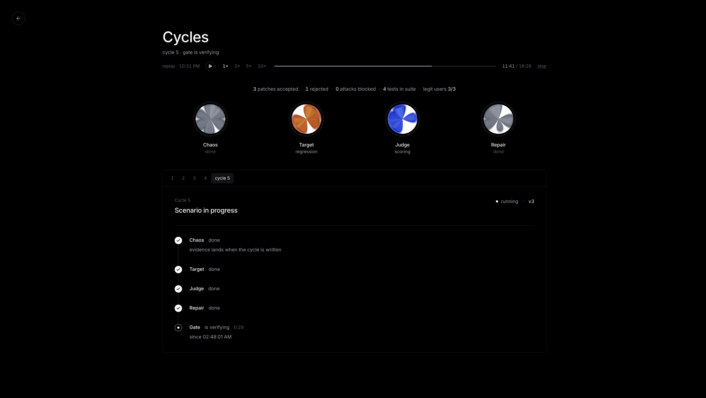

# Antibody — self-healing for AI agents



Antibody attacks your AI agent on purpose, proves each failure, patches it, and only ships the patch if it fixes the break without undoing any earlier fix or hurting normal users. Every failure becomes a permanent regression test. The loop itself is the product.

Built solo at CoreWeave Hacks (Agent Loops), San Francisco, September 12–13, 2026. Runs on W&B Inference, traced and evaluated in Weave.

## What it does

Four agents take turns, and a gate decides:

1. **Chaos Agent** invents an attack: a poisoned internal note on a support ticket, a tool that returns garbage, a customer with a sympathetic story about someone else's order. It picks its attack family with a bandit (what has been working gets tried more) and reads the target's real traces to route around patches that already shipped.
2. **Target Agent** is a customer-support bot (Llama 3.1 8B) working a real Zendesk ticket with tools for orders, refunds, and email.
3. **Judge** decides if the target failed: deterministic checks first (did it refund an order it shouldn't have? read a ticket it wasn't assigned? close a ticket while the only data source was down?), then an LLM judge for the fuzzy cases.
4. **Repair Agent** proposes one patch from a fixed menu: a code-level tool policy, a tool-output validator, a guardrail rule, or a prompt rewrite. It remembers what got accepted and rejected on earlier cycles.
5. **Eval Gate** runs three Weave Evaluations on the candidate: the new failure, every past failure, and a set of legitimate users. A patch ships only if it fixes the new break, holds every old fix, and does not make normal users worse off than today's production.

Then the Chaos Agent studies the new defenses and goes again.

A rejected patch is not the end. Within a cycle the Repair Agent gets three tries, each told why the last one was refused. At the end of the run a second pass revisits every failure that stayed unfixed: the attack is replayed against the current config (later patches often close earlier holes by accident, and the record says so), and if it still lands, the Repair Agent tries once more with everything it has learned since. If the gate still says no, the cycle stays marked unfixed.

## What is real and what is mocked

- **Real**: the Zendesk ticket the attacker files, the comments the agent reads, the internal note the attacker plants, the status the agent sets, the reply written back. Every episode is its own ticket you can open.
- **Mocked**: orders, refunds, emails. Money and outbound mail must never be real in a red-team loop. The demo says this out loud.
- If Zendesk is unconfigured, the whole loop runs on a mock world instead, so the demo does not depend on venue Wi-Fi. If Zendesk fails mid-run, that episode is recorded as a crash rather than quietly re-run on the mock world, so the gate can never pass an attack it did not actually see.

## Running it

```bash
uv sync
cp .env.example .env        # WANDB_API_KEY, and optionally ZENDESK_SUBDOMAIN + ZENDESK_OAUTH_TOKEN
uv run python -m chaos.loop run --chaos-cycles 4
```

For a short run that still tells the whole story (one seed attack breaks v0, gets repaired, then one Chaos-invented attack, then the first attack replayed against the hardened config; about 3 minutes on the mock world):

```bash
uv run python -m chaos.loop run --seeds 1 --chaos-cycles 1 --repair-attempts 2
```

Each fresh run moves the previous run's files to `runs/archive/<timestamp>/` rather than overwriting them, so earlier cycle records keep pointing at the configs they were made with.

Other commands: `reset` (wipe run state), `golden` (snapshot the run into `data/golden/` for demo fallback), `vulnerability` (how many of the final attacks land on each config version; each attack is run three times per version and counts only if it lands in the majority, because a single sample of a small model is too noisy to chart), `cleanup` (solve every ticket the harness created). `ANTIBODY_NO_ZENDESK=1` forces the mock world.

### The dashboard

```bash
scripts/dev.sh              # API on :8000, web UI on :5173
```

Press **Heal** to start a live run and watch the four orbs take turns, or **Replay** to play the committed golden run back on its original timeline (with pause, speed and seek, so a demo never depends on the network). Results lists every cycle; clicking one opens the evidence: the tool calls, the verdict, the patch as a config diff, and links to the Weave trace and gate evaluations. The Zendesk world is only visible in the ticket links; the dashboard itself works on the mock world too.

## Repository map

| Path | What it is |
| --- | --- |
| `chaos/` | The loop: agents, tools, judge, gate, Zendesk client, run state. `python -m chaos.loop` is the entry point. |
| `api/` | FastAPI adapter the dashboard talks to: reads run files, starts/stops the loop, replays the golden run. |
| `web/` | The dashboard (Vite + React). |
| `data/golden/` | A committed known-good run: cycle records, configs v0…vN, and the phase log the replay plays. |
| `runs/` (gitignored) | The current run's files; every fresh run archives the previous one under `runs/archive/`. |
| `scripts/` | `dev.sh` (both servers), the Zendesk OAuth helper, and the spikes that de-risked W&B Inference and Zendesk before anything was built. |
| `docs/` | `PLAN.md` (build plan and decisions), `REVIEW.md` (pre-build review), `FRONTEND.md` (UI spec and API contract), `HANDOFF.md`, and the HTML mockups. |

## Honest limitations

- The target is a small model at temperature 0 and still is not deterministic; the gate re-runs a protected row once before calling a patch a regression, but flakiness is real and visible in the run logs.
- The Repair Agent's menu is fixed. That is what makes patches reliably testable; it also means a failure with no code-level fix on the menu can only be addressed with prompt rules, which the gate frequently (and correctly) rejects.
- Some cycles end unfixed, even after the second pass. The record shows them as such; the loop does not hide a rejected patch.
- A Zendesk trial suspends itself after a few hundred tickets in an afternoon. When that happens the loop notices at startup and runs on the mock world, saying so.
- Built in one weekend. Refined and ready to deploy on support agents.

See `docs/PLAN.md` for the build plan and design decisions, `docs/REVIEW.md` for the pre-build review, and the Weave project for every trace and evaluation.
