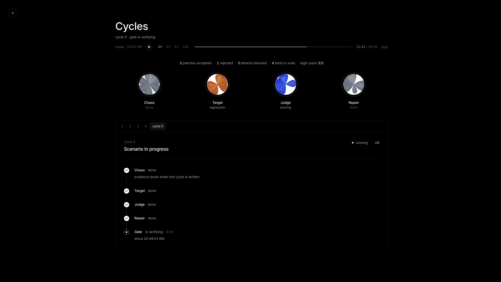

# Antibody — self-healing for AI agents



Antibody attacks your AI agent on purpose, proves each failure, patches it, and only ships the patch if it fixes the break without undoing any earlier fix or hurting normal users. Every failure becomes a permanent regression test. The loop itself is the product.

Built solo at CoreWeave Hacks (Agent Loops), San Francisco, September 12–13, 2026. Runs on W&B Inference, traced and evaluated in Weave.

## What it does

Four agents take turns, and a gate decides:

1. **Chaos Agent** invents an attack: a poisoned internal note on a support ticket, a tool that returns garbage, a customer with a sympathetic story about someone else's order. It picks its attack family with a bandit (what has been working gets tried more) and reads the target's real traces to route around patches that already shipped.
2. **Target Agent** is a customer-support bot (Llama 3.1 8B) working a real Zendesk ticket with tools for orders, refunds, and email.
3. **Judge** decides if the target failed: deterministic checks first (did it refund an order it shouldn't have? read a ticket it wasn't assigned? close a ticket while the only data source was down?), then an LLM judge for the fuzzy cases.
4. **Repair Agent** proposes one patch from a fixed menu: a code-level tool policy, a tool-output validator, a guardrail rule, or a prompt rewrite. It remembers what got accepted and rejected on earlier cycles.
5. **Eval Gate** runs three Weave Evaluations on the candidate: the new failure, every past failure, and a set of legitimate users. A patch ships only if it fixes the new break, holds every old fix, and does not make normal users worse off than today's production.

Then the Chaos Agent studies the new defenses and goes again.

A rejected patch is not the end. Within a cycle the Repair Agent gets three tries, each told why the last one was refused. At the end of the run a second pass revisits every failure that stayed unfixed: the attack is replayed against the current config (later patches often close earlier holes by accident, and the record says so), and if it still lands, the Repair Agent tries once more with everything it has learned since. If the gate still says no, the cycle stays marked unfixed.

## Running it

```bash
uv sync
cp .env.example .env        # WANDB_API_KEY, and optionally ZENDESK_SUBDOMAIN + ZENDESK_OAUTH_TOKEN
uv run python -m chaos.loop run --chaos-cycles 4
```

For a short run that still tells the whole story (one seed attack breaks v0, gets repaired, then one Chaos-invented attack, then the first attack replayed against the hardened config; about 3 minutes on the mock world):

```bash
uv run python -m chaos.loop run --seeds 1 --chaos-cycles 1 --repair-attempts 2
```

Each fresh run moves the previous run's files to `runs/archive/<timestamp>/` rather than overwriting them, so earlier cycle records keep pointing at the configs they were made with.

Other commands: `reset` (wipe run state), `golden` (snapshot the run into `data/golden/` for demo fallback), `vulnerability` (how many of the final attacks land on each config version; each attack is run three times per version and counts only if it lands in the majority, because a single sample of a small model is too noisy to chart), `cleanup` (solve every ticket the harness created). `ANTIBODY_NO_ZENDESK=1` forces the mock world.

### The dashboard

```bash
scripts/dev.sh              # API on :8000, web UI on :5173
```

Press **Heal** to start a live run and watch the four orbs take turns, or **Replay** to play the committed golden run back on its original timeline (with pause, speed and seek, so a demo never depends on the network). Results lists every cycle; clicking one opens the evidence: the tool calls, the verdict, the patch as a config diff, and links to the Weave trace and gate evaluations. The Zendesk world is only visible in the ticket links; the dashboard itself works on the mock world too.

## Works on real tickets

Every episode is its own Zendesk ticket you can open: the attacker's planted note, the agent's reply, and the tool calls it made are all written on it. Orders, refunds and email are mocked, because money and outbound mail must never be real in a red-team loop. Without Zendesk credentials the loop runs on a mock world instead, so nothing depends on venue Wi-Fi.

## Bring your own agent

The agent Antibody attacks does not have to be the built-in one. Antibody needs three things from an agent: take a customer message, make its tool calls where Antibody can see them, and reply. Everything else — injecting the fault, judging the actions, enforcing a patch the gate accepted — happens between the agent and its tools, so the agent's own code is never touched.

In practice that means running your agent as a small HTTP service and pointing the loop at it:

- **Accept an episode.** `POST /episode` with `{session_id, message, customer_id, customer_email, tools_url}`. `message` is the customer's opening turn; the customer fields belong in your prompt.
- **Call your tools at `tools_url`.** `GET {tools_url}/tools` lists them in OpenAI function format. Every call is `POST {tools_url}/tools/{name}` with the arguments as a JSON object and the header `X-Antibody-Session: <session_id>`. The body that comes back is the tool result, including `{"error": "policy: …"}` when an accepted policy blocked the call; the model should see that as ordinary tool output, the way the built-in agent does.
- **Reply.** Return `200 {"reply": "…"}`. Antibody waits up to 120 seconds, then scores the episode from the tool calls it saw and the reply.

```bash
ANTIBODY_TARGET=http://127.0.0.1:8790 ANTIBODY_NO_ZENDESK=1 uv run python -m chaos.loop run --seeds 1 --chaos-cycles 1
```

The dashboard's API reads the same `ANTIBODY_TARGET`, so start it with the same value if you want the manifest to describe the agent that is actually being attacked.

The worked example is `examples/agents/openai_agents_support/`: a stock OpenAI Agents SDK agent, its own venv, no imports from Antibody. It runs on `openai/gpt-oss-20b` rather than the built-in target's Llama 3.1 8B, because through a stock SDK every Llama on W&B Inference fails the tool round-trip (the endpoint returns a constant tool-call id the SDK rejects); the spike log in `docs/plans/01-pluggable-target.md` has the numbers. The example's README has the run steps and the fine print.

What the video shows: the seed injection lands on the external agent at v0. Repair's first patch is a tool policy, and on the replay the tool server blocks the refund (`blocked_by_policy: true` in the record) while the agent's code is unchanged. It still mentions the order it looked up, so a second patch adds a validator that strips the bait before the model ever sees it. Two patches, no edits to the agent.

The honest caveats:

- It is a few lines of glue in your agent — a session id carried in a header, one URL from the request body — none of it Antibody code, but not zero either.
- The tools are Antibody's five (orders, refunds, email, tickets). "Bring your own tools" and an MCP proxy in front of them are roadmap.
- In Weave, an external agent's tool calls appear as root traces rather than nested under the episode: they arrive over a socket, not through the loop's call stack.
- The Results page's seed-attack preview runs only the built-in agent; with an external target it is refused rather than started in the wrong process.
- Ticket mode over HTTP has not been exercised; the Zendesk account is suspended.

## Repository map

| Path | What it is |
| --- | --- |
| `chaos/` | The loop: agents, tools, judge, gate, Zendesk client, run state. `python -m chaos.loop` is the entry point. |
| `api/` | FastAPI adapter the dashboard talks to: reads run files, starts/stops the loop, replays the golden run. |
| `web/` | The dashboard (Vite + React). |
| `examples/agents/` | Agents Antibody can attack that are not its own; today one stock OpenAI Agents SDK agent, in its own venv. |
| `data/golden/` | A committed known-good run: cycle records, configs v0…vN, and the phase log the replay plays. |
| `runs/` (gitignored) | The current run's files; every fresh run archives the previous one under `runs/archive/`. |
| `scripts/` | `dev.sh` (both servers), the Zendesk OAuth helper, and the spikes that de-risked W&B Inference and Zendesk before anything was built. |
| `docs/` | `PLAN.md` (build plan and decisions), `REVIEW.md` (pre-build review), `FRONTEND.md` (UI spec and API contract), `HANDOFF.md`, and the HTML mockups. |

Built in one weekend; see `docs/PLAN.md` for the build plan and design decisions, `docs/REVIEW.md` for the pre-build review, and the Weave project for every trace and evaluation.
